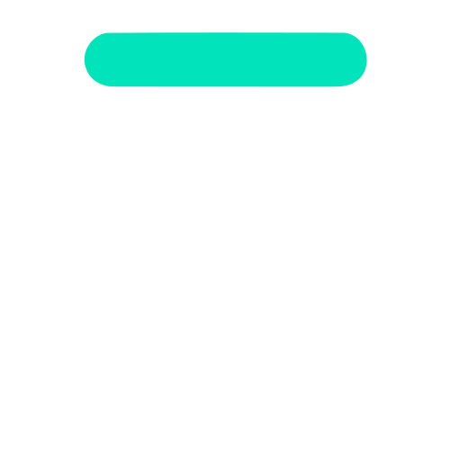
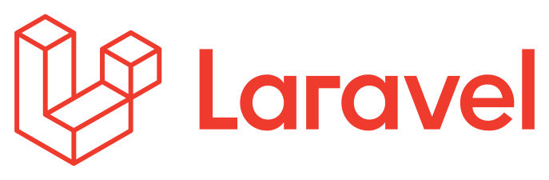
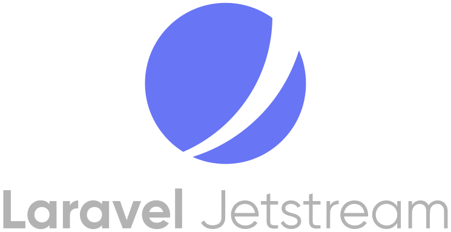

# Application Questionnaire TEST

| |  |  |
| ------------- | :-------------:| -------------:|
|  |  | |
-------

## Installation

- aaaaaa
- bbbbbbb
- ccccccc

Laravel is accessible, powerful, and provides tools required for large, robust applications.

## License

Le framework Laravel est en open-source sous licence [MIT license](https://opensource.org/licenses/MIT).
