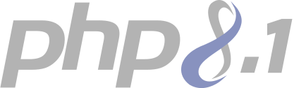

# Application Questionnaire TEST

| |  |  |
| ------------- | :-------------:| -------------:|
|  |  | |
-------

## Installation

* Nécessite PHP>=8.0.

* Cloner la repository git :
    *`git clone https://github.com/Treedent/Questionnaire.git`

* Créer une base de donnée MySQL.

* Copier le fichier `.env.example` vers le fichier `.env` :
    * `cp .env.example .env` 

* Configurer dans le fichier `.env` avec vos informations d'accès à la base de données:
    * DB_CONNECTION=mysql
    * DB_HOST=127.0.0.1
    * DB_PORT=3306
    * DB_DATABASE=votre_base_de_données
    * DB_USERNAME=votre_user
    * DB_PASSWORD=votre_mot_de_passe
      
* Générer une clé pour l'application :
    * `php artisan key:generate`

* Mettre à jour les dépendances PHP :
    * `composer update`

* Installer les dépendances NPM :
    * `npm install`

* Mettre à jour les dépendances NPM :
    * `npm update` 

* Générer les assets :
    * `npm run prod`

* Lancer les migrations :
    * `php artisan migrate`

* Lancer les seeds pour l'équipe, le user, le questionnaire et les questions :
    * `php artisan db:seed --class=TeamSeeder`
    * `php artisan db:seed --class=UserSeeder`
    * `php artisan db:seed --class=QuestionnnaireSeeder`
    * `php artisan db:seed --class=QuestionsSeeder`

* Créer le lien symbolique du storage :
    * `php artisan storage:link`

* Vider tous les caches Laravel :
    * `php artisan optimize`

* Lancer le serveur Web :
    * `php artisan serve`

* Se rendre à l'adresse `http://127.0.0.1:8000` dans votre navigateur.

* Login administrateur : 
    * `admin@questionnaire.lba`

* mot de passe : 
    * `password`

* Enjoy !

## License

Le framework Laravel est en open-source sous licence [MIT license](https://opensource.org/licenses/MIT).
